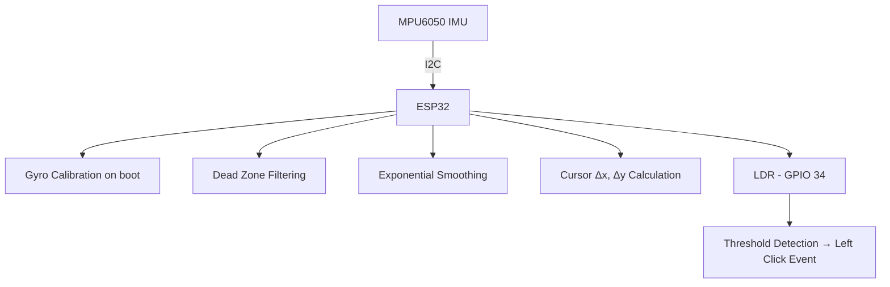

Air Mouse using ESP32
A gesture-controlled wireless mouse built on the ESP32 microcontroller, utilizing an MPU6050 inertial measurement unit for motion tracking and an LDR (Light Dependent Resistor) for click detection. The device communicates with a host system via Bluetooth Low Energy (BLE) HID protocol, eliminating the need for any physical surface or USB receiver.

Overview
The Air Mouse using ESP32 is an embedded systems project that enables cursor control through natural hand gestures. By reading real-time gyroscopic data from the MPU6050 sensor and transmitting processed HID mouse events over BLE, the device functions as a fully wireless, surface-independent pointing device. Click input is handled via an LDR, which detects occlusion (e.g., a finger covering the sensor) and maps it to a left mouse button event.

Features
Gyroscope-based cursor control — Real-time hand orientation data from the MPU6050 is translated into smooth 2D cursor movement.
LDR click detection — Ambient light sensing enables right-click simulation through finger occlusion.
Bluetooth Low Energy (BLE) HID — Native wireless connectivity with no drivers or USB receiver required.
Startup gyro calibration — Automatic offset calculation on boot to eliminate sensor drift.
Dead zone filtering — Suppresses unintentional micro-movements below a defined threshold.
Exponential smoothing — Reduces signal noise for stable and fluid cursor behavior.

Hardware Requirements
| Component | Specification |
| --------- | ------------- |
| Microcontroller |	ESP32 Development Board |
| IMU Sensor |	MPU6050 (I2C, 6-axis) |
| Light Sensor |	LDR (Light Dependent Resistor) |
| Resistor	| 10kΩ (pull-down for LDR voltage divider) |
| Connecting Wires	| Jumper wires |
| Power Supply	| USB (5V via development board) |

Circuit Connections
MPU6050 → ESP32
| MPU6050 Pin	| ESP32 Pin |
| ----------- | --------- |
| VCC |	3.3V |
| GND	| GND |
| SDA	| GPIO 21 |
| SCL	| GPIO 22 |

LDR → ESP32
| LDR Terminal | Connection |
| ------------ | ---------- |
| Terminal A |	3.3V |
| Terminal B |	GPIO 34 + 10kΩ resistor to GND |
> Note: GPIO 34 is an input-only ADC pin on the ESP32 and is well-suited for analog sensor readings.

Software Dependencies
The following libraries must be installed prior to compilation:
Library	Author	Purpose
`Adafruit MPU6050`	Adafruit	MPU6050 sensor interface
`Adafruit Unified Sensor`	Adafruit	Unified sensor abstraction layer
`ESP32 BLE Mouse`	T-vK	BLE HID mouse emulation
Install via Arduino IDE Library Manager (`Sketch → Include Library → Manage Libraries`) or through PlatformIO.

Installation & Setup
Clone the repository
git clone: https://github.com/Rucha7679/Air-Mouse-using-ESP32
Open the sketch — Launch `Code.ino` in the Arduino IDE.
Install dependencies — Install all libraries listed in the Software Dependencies section.
Select the target board
Navigate to `Tools → Board → ESP32 Arduino → ESP32 Dev Module`.
Upload the firmware — Connect the ESP32 via USB and click Upload.
Pair the device
On the host system, open Bluetooth settings and pair with the device advertised as "ESP32 Air Mouse".
Calibration
Upon powering on, the device performs an automatic gyroscope calibration. Keep the device stationary for approximately 3 seconds until calibration completes (indicated via Serial Monitor).
Operation
Cursor movement — Tilt the device to move the cursor.
Left click — Cover the LDR sensor with a finger to trigger a click event.

Configuration
The following parameters in `Code.ino` can be adjusted to suit different use cases or hardware setups:

// LDR sensitivity — increase to require more darkness for click detection
const int CLICK\\\_THRESHOLD = 500;
// Cursor speed multiplier — increase for faster cursor movement
int moveX = (int)(smoothedX \\\* 8);
int moveY = (int)(-smoothedY \\\* 8);
// Smoothing factor — higher value = smoother but slightly delayed response
smoothedX = 0.8 \\\* smoothedX + 0.2 \\\* gx;
smoothedY = 0.8 \\\* smoothedY + 0.2 \\\* gy;
// Dead zone threshold — increase to reduce cursor jitter at rest
if (abs(gx) < 0.5) gx = 0;
if (abs(gy) < 0.5) gy = 0;

System Architecture

Acknowledgements
Adafruit Industries — MPU6050 and Unified Sensor libraries
T-vK — ESP32 BLE Mouse library
